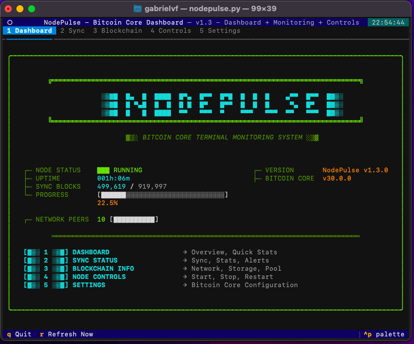
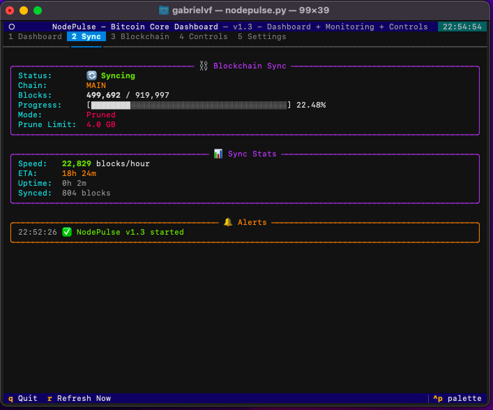
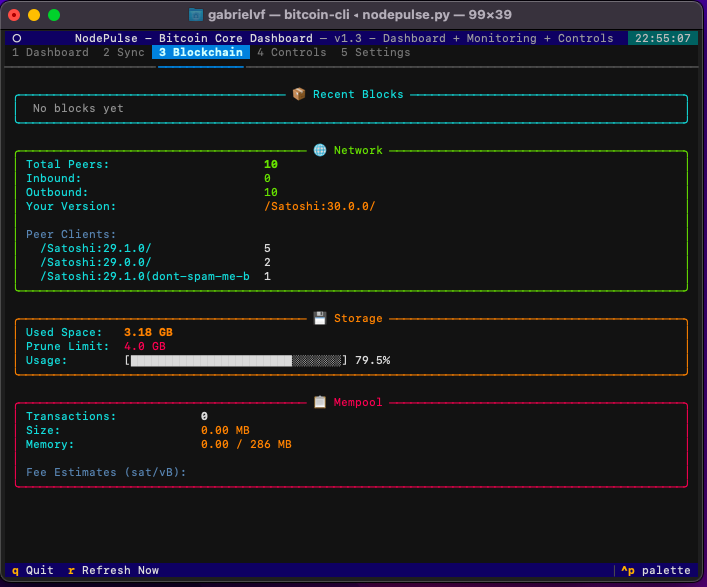
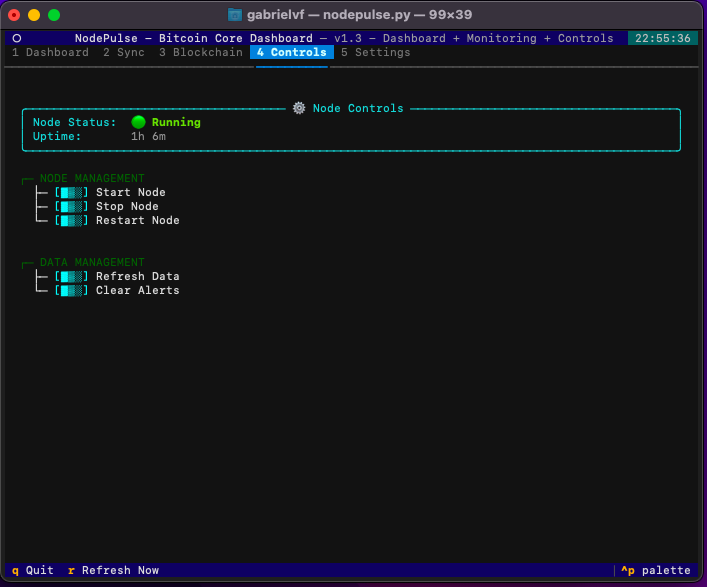
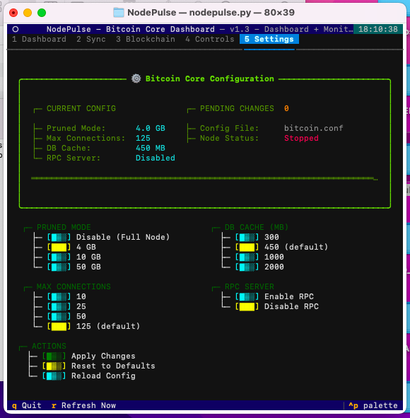

# NodePulse

**A beautiful terminal dashboard for monitoring your Bitcoin Core node in real-time**


[](https://github.com/GabrielVF/NodePulse)

## Overview

NodePulse is a Terminal User Interface (TUI) application that provides a real-time, visual dashboard for monitoring your Bitcoin Core node. Built with Python and Textual, it offers an intuitive way to keep track of your node's health, sync status, network connections, and more.

## Screenshots

### 1. Dashboard - Welcome Screen

*Retro/terminal welcome screen with ASCII logo, quick stats, and navigation menu*

### 2. Sync Status

*Blockchain synchronization progress, sync statistics, and alerts*

### 3. Blockchain Info

*Network connections, storage usage, and mempool information*

### 4. Node Controls

*Start, stop, and restart your Bitcoin node with interactive buttons*

### 5. Settings

*Bitcoin Core configuration editor with live preview and safe updates*

## Features

### Current Features (v1.3.0)

#### 🎨 Retro/Terminal UI Design (v1.3)
- **Matrix-style aesthetic** - Green/cyan/yellow color scheme with ASCII art
- **Compact logo** - Retro terminal design using block characters (░▒▓█)
- **Interactive controls** - Custom hover effects with color transitions
- **5-tab navigation** - Dashboard, Sync, Blockchain, Controls, Settings
- **Vertical menu** - Clean one-line-per-tab navigation
- **ASCII-style buttons** - Elegant [▓▒░] markers throughout the UI

#### ⚙️ Bitcoin Core Settings (v1.3)
- **Configuration editor** - Edit bitcoin.conf directly from the UI
- **Pruned mode control** - Switch between Full Node/4GB/10GB/50GB
- **Connection limits** - Adjust max connections (10/25/50/125)
- **DB cache tuning** - Set database cache size (300/450/1000/2000 MB)
- **RPC server toggle** - Enable/disable RPC server
- **Live preview** - See current and pending changes before applying
- **Safe updates** - Automatic backups and confirmation dialogs
- **Node restart** - Optional restart after config changes

#### 🎮 Node Controls (v1.2-1.3)
- **Start/Stop/Restart** - Control bitcoind directly from the UI
- **Node status monitoring** - Real-time running/stopped indicator
- **Confirmation dialogs** - Safe operation with user confirmation
- **Process detection** - Reliable node status using psutil
- **Refresh & Clear** - Manual data refresh and alert clearing

#### 📊 Monitoring Dashboard

✅ **Blockchain Synchronization Panel**
- Real-time sync status and progress
- Current block height vs. total headers
- Visual progress bar
- Pruned/Full node mode indicator
- Prune limit display (for pruned nodes)

✅ **Sync Statistics Panel** (v1.1)
- Blocks per hour tracking
- ETA estimation for sync completion
- Session uptime
- Total blocks synced counter

✅ **Network Panel**
- Total peer connections
- Inbound/Outbound connection breakdown
- Your node's version
- Connected peer client versions

✅ **Storage Panel**
- Current disk space usage
- Prune limit tracking (for pruned nodes)
- Visual usage bar for pruned nodes
- Full node indicator

✅ **Mempool Panel**
- Total pending transactions
- Mempool size (MB)
- Memory usage
- Fee estimates for different confirmation targets (1, 3, 6 blocks)

✅ **Alerts System** (v1.1)
- Visual notifications panel
- Sync completion alerts
- Low peer warnings
- Node connectivity status
- Color-coded severity levels

✅ **Recent Blocks Panel** (v1.1)
- Last 5 processed blocks
- Block height, hash, transaction count
- Block size and timestamp

### Additional Features
- **Intelligent auto-detection** - Finds Bitcoin Core automatically (no manual configuration needed)
- **Performance optimized** - Async RPC calls, tab-aware updates
- Auto-refresh every 10 seconds (non-blocking)
- Manual refresh with `r` key (instant)
- 5-tab navigation (`1` = Dashboard, `2` = Sync, `3` = Blockchain, `4` = Controls, `5` = Settings)
- Retro/terminal aesthetic with color-coded panels
- Keyboard shortcuts for all actions
- Real-time clock in header
- Custom ClickableLabel widgets with hover effects
- Instant tab switching (no lag)
- Cross-platform support (macOS, Linux, Windows)

## Requirements

- **Python 3.9+**
- **Bitcoin Core 27.0+** (with `bitcoind` running)
- **bitcoin-cli** accessible from `~/bin/bitcoin-cli`
- Terminal with 256-color support

### Python Dependencies
- `textual >= 6.3.0` - Terminal UI framework
- `rich >= 14.2.0` - Text rendering and formatting
- `psutil >= 7.1.1` - Process and system utilities

## Installation

### Quick Install (Already Done)

The application is already installed and ready to use! All dependencies have been installed.

### Manual Installation (For New Users)

If you're setting up NodePulse on a new system:

```bash
# Clone the repository
git clone https://github.com/GabrielVF/NodePulse.git
cd NodePulse

# Install Python dependencies
pip3 install --user -r requirements.txt

# Make the script executable (optional)
chmod +x nodepulse.py

# Run NodePulse
python3 nodepulse.py
```

### Project Structure
```
NodePulse/
├── nodepulse.py              # Main application (~2000 lines)
├── config.toml.example       # Example configuration file
├── screenshots/              # Application screenshots
│   ├── 01-dashboard.png
│   ├── 02-sync.png
│   ├── 03-blockchain.png
│   ├── 04-controls.png
│   └── 05-settings.png
├── requirements.txt          # Python dependencies
├── README.md                 # This file
├── CLAUDE.md                 # Technical documentation
├── LICENSE                   # MIT License
└── .gitignore               # Git ignore rules
```

## Usage

### Starting NodePulse

If you have the launcher script installed (`~/bin/nodepulse`):

```bash
nodepulse
```

Or run directly from the project directory:

```bash
cd NodePulse
python3 nodepulse.py
```

Or with absolute path:

```bash
python3 /path/to/NodePulse/nodepulse.py
```

### Keyboard Shortcuts

- **`q`** - Quit NodePulse
- **`r`** - Refresh data immediately (auto-refreshes every 10s)
- **`1`** - Switch to Dashboard tab
- **`2`** - Switch to Sync tab
- **`3`** - Switch to Blockchain tab
- **`4`** - Switch to Controls tab
- **`5`** - Switch to Settings tab

### Prerequisites

Make sure your Bitcoin Core node is running:

```bash
# Start bitcoind if not already running
~/bin/bitcoind -daemon

# Check if bitcoind is running
~/bin/bitcoin-cli getblockchaininfo
```

## Configuration

### Automatic Bitcoin Core Detection

NodePulse **automatically detects** your Bitcoin Core installation using intelligent cascade detection:

1. **Environment Variable** - `BITCOIN_CLI_PATH`
   ```bash
   export BITCOIN_CLI_PATH=/custom/path/bitcoin-cli
   ```

2. **Config File** - `~/.config/nodepulse/config.toml` or `~/.nodepulse/config.toml`
   ```toml
   [bitcoin]
   cli_path = "/usr/local/bin/bitcoin-cli"
   ```

3. **System PATH** - Searches for `bitcoin-cli` in your PATH

4. **Standard Locations**:
   - **macOS**: `~/bin/`, `/usr/local/bin/`, `/opt/homebrew/bin/`, `/Applications/Bitcoin-Qt.app/Contents/MacOS/`
   - **Linux**: `~/bin/`, `/usr/bin/`, `/usr/local/bin/`, `~/.local/bin/`
   - **Windows**: `C:\Program Files\Bitcoin\`, `%APPDATA%\Bitcoin\`

5. **Bitcoin Datadir Detection** - Searches near Bitcoin data directory

6. **Fallback** - `~/bin/bitcoin-cli`

**Detection info is shown in alerts** when NodePulse starts, indicating which method found your Bitcoin CLI.

### Configuration File (Optional)

Create a config file for custom settings:

```bash
# Create config directory
mkdir -p ~/.config/nodepulse

# Copy example config
cp config.toml.example ~/.config/nodepulse/config.toml

# Edit with your settings
nano ~/.config/nodepulse/config.toml
```

See `config.toml.example` for all available options.

### Bitcoin Core Settings Editor

NodePulse v1.3 includes a built-in configuration editor accessible from the **Settings tab** (press `5`). You can:

- Adjust pruned mode settings
- Change max connections
- Tune database cache
- Enable/disable RPC server
- View current settings vs pending changes
- Apply changes with automatic backups
- Restart node after configuration updates

This edits your `bitcoin.conf` file directly:
- **macOS**: `~/Library/Application Support/Bitcoin/bitcoin.conf`
- **Linux**: `~/.bitcoin/bitcoin.conf`
- **Windows**: `%APPDATA%\Bitcoin\bitcoin.conf`

## Application Layout

### Tab 1: Dashboard
Retro/terminal welcome screen with:
- ASCII logo and banner
- Vertical navigation menu
- Quick overview with node status, sync progress, and network info

### Tab 2: Sync
**Row 1:** Blockchain Sync | Sync Stats
**Row 2:** Alerts | Recent Blocks

### Tab 3: Blockchain
**Row 1:** Network | Storage
**Row 2:** Mempool (full width)

### Tab 4: Controls
Interactive node management with:
- Start/Stop/Restart buttons
- Manual refresh and clear alerts
- Node status indicator

### Tab 5: Settings
Bitcoin Core configuration editor with:
- 2-column grid layout (Pruned Mode + Max Connections | DB Cache + RPC Server)
- Current config display
- Pending changes tracker
- Apply/Reset/Reload buttons

Active tab updates automatically every 10 seconds with real-time data from your Bitcoin node (optimized for performance).

## Roadmap

### Version 1.3 (Released) ✅
- [x] Settings tab for Bitcoin Core configuration
- [x] Retro/terminal UI design
- [x] Custom ClickableLabel widgets with hover effects
- [x] 5-tab navigation
- [x] Bitcoin.conf editor with live preview
- [x] Configuration backups and safe updates

### Version 1.4 (Planned)
- [ ] NodePulse configuration file (`config/nodepulse.toml`)
- [ ] Custom refresh interval (editable in Settings)
- [ ] Color theme selection (dark/light/matrix)
- [ ] Export stats to CSV/JSON
- [ ] Historical charts (blocks/hour, peer count over time)
- [ ] Advanced Bitcoin Core settings (blocksonly, txindex, network options)

### Version 2.0 (Future)
- [ ] Multi-node support (monitor multiple nodes)
- [ ] Web interface option
- [ ] REST API for external integrations
- [ ] Mobile notifications support
- [ ] Lightning Network integration (if LND/CLN running)

### Community Requests
Have a feature idea? Open an issue or submit a pull request!

## Troubleshooting

### NodePulse shows "Waiting for node data..."

**Solution:** Make sure `bitcoind` is running:
```bash
~/bin/bitcoind -daemon
```

### "Error: Not enough file descriptors"

**Solution:** The launcher script automatically sets `ulimit -n 4096`. If you still see this error, increase the limit manually:
```bash
ulimit -n 8192
```

### Python dependencies not found

**Solution:** Reinstall dependencies:
```bash
pip3 install --user textual rich
```

### bitcoin-cli command not found

**Solution 1:** Set environment variable:
```bash
export BITCOIN_CLI_PATH=/path/to/bitcoin-cli
```

**Solution 2:** Create config file:
```bash
mkdir -p ~/.config/nodepulse
cat > ~/.config/nodepulse/config.toml << EOF
[bitcoin]
cli_path = "/path/to/bitcoin-cli"
EOF
```

**Solution 3:** Add bitcoin-cli to your PATH:
```bash
# Add to ~/.bashrc or ~/.zshrc
export PATH="$PATH:/path/to/bitcoin/bin"
```

NodePulse will automatically detect it on next launch and show detection info in alerts.

## Development

### Making Changes

1. Edit the source code at `nodepulse.py`
2. Test your changes: `python3 nodepulse.py`
3. Changes take effect immediately (no need to reinstall)

### Running from Source

```bash
# Clone the repository
git clone https://github.com/GabrielVF/NodePulse.git
cd NodePulse

# Install dependencies
pip3 install -r requirements.txt

# Run directly
python3 nodepulse.py
```

### Adding New Panels

NodePulse uses Textual's component system. To add a new panel:

1. Create a new class inheriting from `Static`
2. Implement `update_data()` and `update_render()` methods
3. Add the panel to `NodePulseApp.compose()`
4. Update `refresh_data()` to populate your panel

## Contributing

Contributions are welcome! Whether it's:
- Bug fixes
- New features
- Documentation improvements
- UI/UX enhancements

Feel free to fork and submit pull requests.

## License

MIT License - Feel free to use, modify, and distribute as you see fit.

## Credits

Built with:
- [Textual](https://github.com/Textualize/textual) - Modern TUI framework
- [Rich](https://github.com/Textualize/rich) - Beautiful terminal formatting
- [Bitcoin Core](https://bitcoincore.org/) - The Bitcoin reference implementation

## Support

For issues, questions, or suggestions:
- Open an issue in this repository
- Check the troubleshooting section above
- Review the Bitcoin Core documentation: https://bitcoincore.org/

---

**NodePulse** - Keep your finger on the pulse of your Bitcoin node 💓

*Made with ❤️ for the Bitcoin community*
